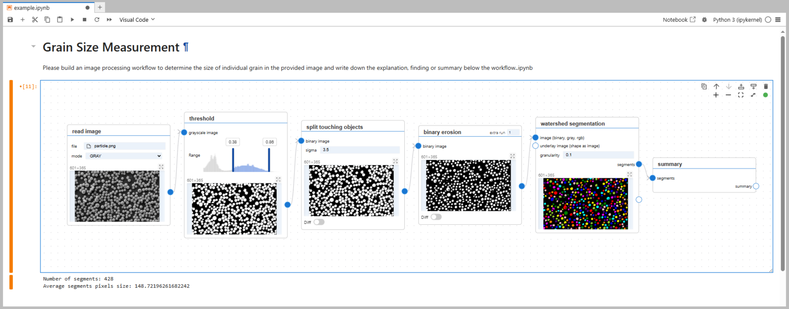
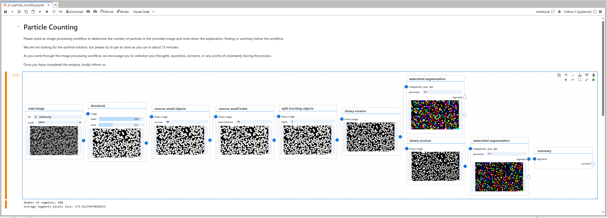

<h1 align="center">SysA</h1>

<p align="center">
<a href="https://mybinder.org/v2/gh/anonymizedsubmission1024/SysA/HEAD"></a>
<a href="./LICENSE"></a>
</p>

<p align="center">
<em>Notebook-Embedded Visual Workflow Authoring for Scientific Image Processing</em>
</p>

<p align="center">

</p>

## Key Features

- Drag-and-drop node-based programming for image processing
- Image-specific inspection and comparison support, including branching, stepwise views, synchronized viewing, cursor linking, and difference overlays
- Co-locates workflow structure, parameter settings, outputs, and narrative context within a single notebook artifact during authoring

## Quick Start

**Will be published on PyPI once the paper is accepted. For now, please use [](https://mybinder.org/v2/gh/anonymizedsubmission1024/sysa/HEAD) to try it out.**


1. <strike>**Install SysA**</strike>
   ```bash
   pip install SysA
   ```

2. <strike>**Launch JupyterLab**</strike>
   ```bash
   jupyter lab
   ```

3. **Create a new notebook**
   - Click "+" to create a new notebook
   - Add a Visual Code cell from the cell toolbar

4. **Start building workflows**
   - Drag and drop nodes to create your image processing workflows
   - Connect nodes to build workflows
   - Adjust parameters and inspect the outputs to refine the workflows

## Examples

📂 **Examples are available in the `use_cases/` folder**

Below are two representative workflows created by users, demonstrating SysA's capabilities for interactive image processing:

<p align="center">

</p>

<p align="center">

</p>

## Development

- 📖 [Developer Guide](docs/README_DEVELOP.md) - Setup and development instructions
- 🚀 [Release Guide](docs/RELEASE.md) - Package Build and Releae